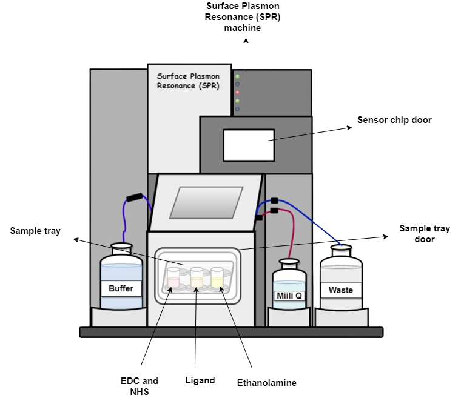
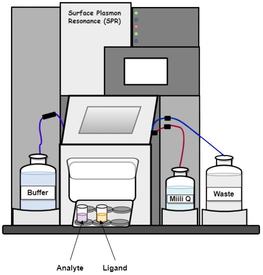

## Procedure
1. Priming the system, Clean with MilliQ 

2.  Dock the SPR sensor chip

3. Prime with buffer

4.  Ligand Immobilization

5. Interaction Analysis

6. Data analysis
  
    1. Surface Plasmon Resonance (SPR) has been considered for 1μM concentration of analyte

   2. Surface Plasmon Resonance (SPR) has been considered for four more (0μM, 0.5μM, 1μM, 2μM, 4μM) concentration  of analyte

