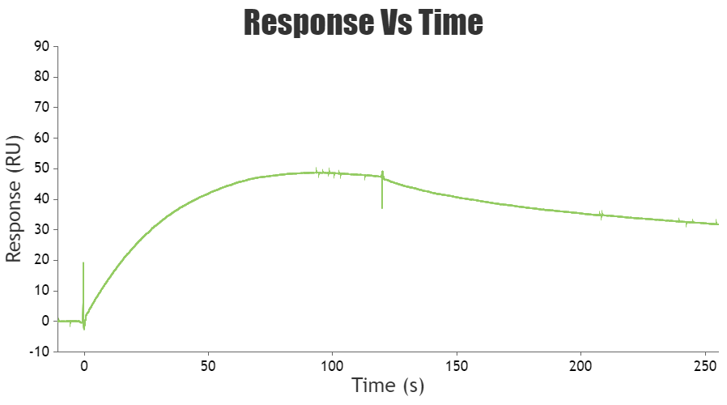
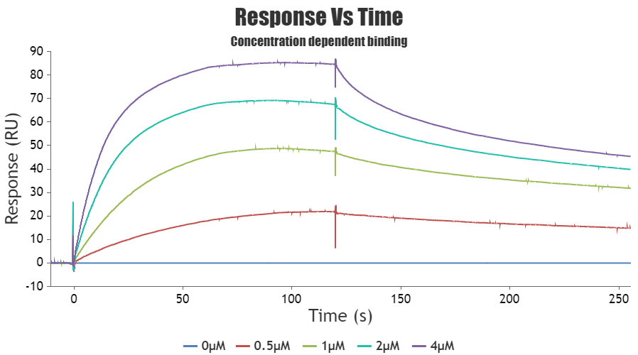

## Procedure

Surface Plasmon Resonance (SPR) is a powerful technique used to study the interactions between biomolecules in real time. It is commonly employed in fields such as biochemistry, pharmacology, and material science. Here's a general procedure for performing a Surface Plasmon Resonance experiment:

1. **Starting up the system**
Switch on the machine. Attach a sensor chip to the instrument. Prime the system with MilliQ and buffer before use.

2. **Starting the experiment**

      1. Ligand immobilization:
The goal of immobilization is to attach an interactant to a sensor surface, either permanently through covalent bonds or temporarily using capturing techniques. Before ligand immobilizations, certain factors should be considered:
    - Amount of ligand to be immobilized
    -  Type of sensor chip
    - Immobilization method 
    - Conditions of immobilization such as temperature, flow rate, buffers etc. 

The procedure of performing the most commonly used immobilization method, covalent immobilization using amine coupling method is discussed below. 
With this method, carboxyl groups on the surface of the sensor chip surface are first activated with a mixture of EDC (1-ethyl-3-(3-dimethyl aminopropyl) carbodiimide) and NHS (N-hydroxysuccinimide) to give reactive succinimide esters. During the ligand immobilization process, the ligand is introduced to the surface and reacts with the dextran matrix. This
reaction results in the covalent linkage of the ligand consisting of the primary amine groups or other nucleophilic groups to the carboxyl group on the sensor chip.  

Once the ligand is immobilized, any remaining active groups on the surface are deactivated by injecting a reagent. This step also helps in removing any ligand that is non-covalently bound to the surface. The final step involves measuring the amount of ligand that is attached to the surface after the deactivation process is completed. This step also helps in removing any ligand that was not covalently attached to the surface.

   

## Simulation instrument setup
1. Priming the system, Clean with MilliQ 

2.  Dock the SPR sensor chip

3. Prime with buffer

4.  Ligand Immobilization

5. Interaction Analysis

6. Data analysis
  
    1. Surface Plasmon Resonance (SPR) has been considered for 1μM concentration of analyte

   2. Surface Plasmon Resonance (SPR) has been considered for four more (0μM, 0.5μM, 1μM, 2μM, 4μM) concentration  of analyte

