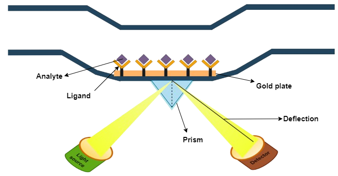

## Procedure

Surface Plasmon Resonance (SPR) is a powerful technique used to study the interactions between biomolecules in real time. It is commonly employed in fields such as biochemistry, pharmacology, and material science. Here's a general procedure for performing a Surface Plasmon Resonance experiment:

1. **Starting up the system**
Switch on the machine. Attach a sensor chip to the instrument. Prime the system with MilliQ and buffer before use.

2. **Starting the experiment**

    1. Ligand immobilization:
The goal of immobilization is to attach an interactant to a sensor surface, either permanently through covalent bonds or temporarily using capturing techniques. Before ligand immobilizations, certain factors should be considered:
    - Amount of ligand to be immobilized
    -  Type of sensor chip
    - Immobilization method 
    - Conditions of immobilization such as temperature, flow rate, buffers etc. 

The procedure of performing the most commonly used immobilization method, covalent immobilization using amine coupling method is discussed below. 
With this method, carboxyl groups on the surface of the sensor chip surface are first activated with a mixture of EDC (1-ethyl-3-(3-dimethyl aminopropyl) carbodiimide) and NHS (N-hydroxysuccinimide) to give reactive succinimide esters. During the ligand immobilization process, the ligand is introduced to the surface and reacts with the dextran matrix. This reaction results in the covalent linkage of the ligand with the primary amine groups or other nucleophilic groups present on the surface.
Once the ligand is immobilized, any remaining active groups on the surface are deactivated by injecting a reagent. This step also helps in removing any ligand that is non-covalently bound to the surface. The final step involves measuring the amount of ligand that is attached to the surface after the deactivation process is completed. This step also helps in removing any ligand that was not covalently attached to the surface.

   2. Interaction kinetics

After successful immobilization of the ligand on the sensor chip, the following steps are performed to study the interaction between ligand and the analyte:

a. **Surface equilibration:** This is the first step where the flow buffer comes in contact with the surface of the sensor to establish the baseline. The baseline should be flat before carrying out any experiment. This is to ensure any excessive drift, injection spikes, and high buffer responses in the system. 

b. **Association phase:** In this step, the sample containing the target compound (analyte) is injected into the flow cell. The capturing elements on the sensor surface bind the target compound, resulting in complex formation. The association phase is the stage where the sensor starts detecting the target compound.

In a reversible interaction between two molecules, the analyte (A) binds to the ligand (B). The rate equation for a 1:1 interaction between the ligand and analyte is given below.
A  +   B    ⇌   AB 

The equation for the rate of a chemical reaction is given by:  
Rate = ka . [A] x [B] - kd . [AB]   
where, ka is the rate constant for the association of reactants A and B to form product AB (association rate constant),  
and kd is the rate constant for the dissociation of product AB back into reactants A and B (dissociation rate constant).   
The equilibrium dissociation constant (KD), which is measured in Molar, is defined by the quotient of : $$  K_D   =     \frac{k_d}{k_a}           $$ 
This constant provides the analyte concentration that is required to saturate 50% of the ligand.  
SPR experiments can be used to measure kinetic binding constants (ka, kd) and equilibrium binding constants (affinity, Ka = 1/Kd).  

c. **Steady state:** When injection time is sufficient, the curve levels out, showing equal association and dissociation events. Req (response at equilibrium) depends on ligand binding sites, analyte concentration, and dissociation constant. The following equations can be used  to calculate Req.

$$  R_{eq} = \frac{k_a.C}{k_a.C +k_d} . R_{max} $$

where, C is the analyte concentration   
Rmax or the maximal response is when all the ligand binding sites are occupied by the analyte. 

d. **Dissociation phase:** After the association phase, the next step is the dissociation phase. Here, the baseline or system buffer is injected to dissociate the target compounds and non-specifically bound molecules from the surface of the sensor. This step is essential for clearing the surface of the sensor before proceeding to the next step.

e. **Regeneration phase:** The final step is the regeneration phase, where the regeneration solution, such as a low-pH buffer, is injected into the sensor to remove any remaining bound target compounds. This step ensures that the sensor is cleaned and ready for the next experiment. The most frequent regeneration method used, is to inject a low pH-buffer such as 10 mM Glycine pH 1.5–2. This works probably because most proteins become partly unfolded and positively charged at low pH. The protein binding sites will repel each other and the unfolding will bring the molecules further apart. 

3. **Sensorgram and data analysis**

SPR experiments can be used to study both kinetics and affinity of the interaction. Both kinetics and equilibrium analysis are important aspects of SPR experiments, and they provide different types of information about the interactions between biomolecules. Kinetics focuses on how fast things happen and includes association and dissociation. Affinity, on the other hand, focuses on how strong a complex is and determines how much complex is formed at equilibrium.

4. **Applications**
Surface Plasmon Resonance (SPR) is a potent analytical technique utilized in various fields such as drug discovery, antibody characterization, protein-protein interactions, and enzyme kinetics. It is a promising tool as it can detect biomolecular interactions in real time and without labelling. SPR has numerous applications in medical diagnostics, environmental monitoring, and drug development. As technology progresses, SPR is expected to become increasingly essential in both basic and applied research.

## Simulation instrument setup
1. Priming the system, Clean with MilliQ 

2.  Dock the SPR sensor chip

3. Prime with buffer

4.  Ligand Immobilization

5. Interaction Analysis

6. Data analysis
  
    1. Surface Plasmon Resonance (SPR) has been considered for 1μM concentration of analyte

   2. Surface Plasmon Resonance (SPR) has been considered for four more (0μM, 0.5μM, 1μM, 2μM, 4μM) concentration  of analyte

