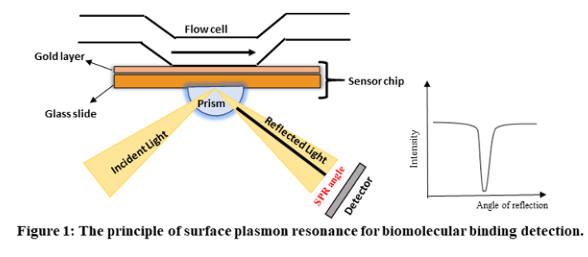
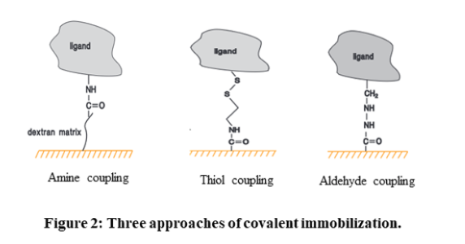

## Theory

Surface Plasmon Resonance (SPR) is a phenomenon that can be observed in thin conducting films at an interface between media of different refractive index. In SPR systems, the media are the glass of the sensor chip and the sample solution, and the conducting film is a thin layer of gold on the sensor chip surface. SPR is a physical process that can occur when plane-polarized light hits a thin metal film under total internal reflection conditions. When a light beam hits a half-circular prism, the light is bent towards the plane of interface, when it is passing from a denser medium to a less dense one. Changing the incidence angle (Θ) changes the out-coming light until it reaches a critical angle. At this point, all the incoming light reflects within the circular prism. This is called total internal reflection (TIR). 
The surface is coated with a thin film of a noble metal, usually gold. Gold is used in sensor chips because it combines favourable SPR characteristics with stability and a high level of inertness in biomolecular interaction contexts. At a certain combination of angle of incidence and energy (wavelength), the incident light excites plasmons (electron charge density waves) in the gold film. As a result, a characteristic absorption of energy via the evanescent wave field occurs and SPR is seen as a drop in the intensity of the reflected light as shown in figure 1.

In an SPR experiment, one molecule (the **Ligand**) is immobilized on a sensor chip and binding to a second molecule (the **Analyte**) is measured under flow.  Response is measured in resonance units (RU) and is proportional to the mass on the surface, and for any given interactant, the response is proportional to the number of molecules bound to the surface.  Response is recorded and displayed as a sensogram in real time.  

#### **SPR principle components:**

SPR instruments comprise three essential units integrated into one system: sensor surface, liquid handling (microfluidic) unit, and the optical unit.

#### 1. **Sensor chip:** 
At the core of SPR systems lies the sensor chip, which creates the physical conditions necessary to generate the SPR signal. The surface of the chip is where the interaction under scrutiny takes place. Typically, the sensor chip in SPR systems comprises a glass slide that is coated with a thin layer of gold. Additionally, to create a conducive environment for the molecular interactions being studied, a linker layer covers the gold surface, and on most sensor chip types, a modified dextran (a flexible unbranched carbohydrate polymer) matrix. The surface matrix determines the sensor chip's characteristics for ligand attachment and molecular interactions.
Dextran-based surface matrices provide a hydrophilic environment for biomolecular interactions, enable efficient immobilization from dilute ligand solutions, increase the surface capacity for ligand immobilization, and extend the region where interactions occur to encompass a surface layer. Moreover, the flexibility of the unbranched polymer chains allows the "surface-attached" biomolecules to move with relative freedom within the surface layer, making dextran an excellent environment for many biomolecular interactions.
Depending upon the properties and nature of biomolecules to be attached on the sensor chip surface, there are different approaches for ligand immobilization: 

- **Covalent immobilization:** Covalent coupling is the preferred immobilization method due to high coupling yields and stable covalent bonds between ligand and sensor chip coating. The carboxymethyl (CM) dextran on Sensor Chip CM5, other CM-series chips and Sensor Chip L1, as well as the carboxyl groups directly attached to the surface of Sensor Chip C1, provide a solid foundation for a range of covalent immobilization chemistries. 
The three most common methods employed are **amine coupling, thiol coupling, and aldehyde coupling**. Amine coupling relies on the activation of the surface with 1-ethyl-3-(3-dimethylaminopropyl)-carbodiimide (EDC) and N-hydroxysuccinimide (NHS) to exploit primary amine groups on the ligand. Thiol coupling uses thiol-disulfide exchange between thiol groups and active disulfides introduced on either the ligand or the surface matrix. Aldehyde coupling employs the reaction between hydrazine or carbohydrazide groups introduced on the surface and aldehyde groups obtained by oxidation of carbohydrates in the ligand.

- **High-affinity capture:** The molecule of interest is attached to another molecule through non-covalent interactions. This other molecule is usually attached to the sensor chip surface through covalent immobilization. 

- **Hydrophobic adsorption:** It exploits hydrophobic interactions to attach either the molecule of interest or a hydrophobic carrier such as a lipid monolayer or bilayer to the sensor chip surface.

#### 2. **Microfluidic system:**
The microfluidic system of SPR consists of an integrated flow cell or IFC, through which the sample containing the analyte is supplied to the sensor surface in a controlled fashion. The delivery of sample and buffer to the flow cells is done with extreme precision through the pump system and valves in the IFC. This ensures that a continuous flow of liquid is maintained over the sensor surface during analysis, switching between buffer and sample with minimal disturbance or dispersion of the sample boundary. The precision in sample delivery plays a crucial role in ensuring the reproducibility of assay procedures and provides the controlled conditions necessary for interpreting kinetic data obtained from the interaction studies.

#### 3. **Optical system:**
As mentioned earlier, the optical system involves a prism-coupled configuration that is commonly used in SPR experiments. This optical system comprises various components, including:
- a monochromatic light source that emits light of a single wavelength
- a prism that facilitates the coupling of light into and out of the sample
- a coupling medium that helps to establish an optical interface between the prism and the sample
- a sample chamber that houses the target analyte
- a detector that records the intensity of the reflected light
- a data analysis system that processes and interprets the collected data. 
Together, these components form a robust optical setup that is capable of measuring the interactions between biomolecules in real-time.

#### Interaction kinetics

After successful immobilization of the ligand on the sensor chip, the following steps are performed to study the interaction between ligand and the analyte:

#### a. **Surface equilibration:** 
This is the first step where the flow buffer comes in contact with the surface of the sensor to establish the baseline. The baseline should be flat before carrying out any experiment. This is to ensure any excessive drift, injection spikes, and high buffer responses in the system. 

#### b. **Association phase:** 
In this step, the sample containing the target compound (analyte) is injected into the flow cell. The capturing elements on the sensor surface bind the target compound, resulting in complex formation. The association phase is the stage where the sensor starts detecting the target compound.

In a reversible interaction between two molecules, the analyte (A) binds to the ligand (B). The rate equation for a 1:1 interaction between the ligand and analyte is given below.
A  +   B    ⇌   AB 

The equation for the rate of a chemical reaction is given by:  
Rate = ka . [A] x [B] - kd . [AB]   
where, ka is the rate constant for the association of reactants A and B to form product AB (association rate constant),  
and kd is the rate constant for the dissociation of product AB back into reactants A and B (dissociation rate constant).   
The equilibrium dissociation constant (KD), which is measured in Molar, is defined by the quotient of : $$  K_D   =     \frac{k_d}{k_a}           $$ 
This constant provides the analyte concentration that is required to saturate 50% of the ligand.  
SPR experiments can be used to measure kinetic binding constants (ka, kd) and equilibrium binding constants (affinity, Ka = 1/Kd).  

#### c. **Steady state:**
 When injection time is sufficient, the curve levels out, showing equal association and dissociation events. Req (response at equilibrium) depends on ligand binding sites, analyte concentration, and dissociation constant. The following equations can be used  to calculate Req.

$$ R_{eq} = \frac{k_a.C}{k_a.C +k_d} . R_{max} $$

where, C is the analyte concentration   
Rmax or the maximal response is when all the ligand binding sites are occupied by the analyte. 

#### d. **Dissociation phase:** 
After the association phase, the next step is the dissociation phase. Here, the baseline or system buffer is injected to dissociate the target compounds and non-specifically bound molecules from the surface of the sensor. This step is essential for clearing the surface of the sensor before proceeding to the next step.

#### e. **Regeneration phase:** 
The final step is the regeneration phase, where the regeneration solution, such as a low-pH buffer, is injected into the sensor to remove any remaining bound target compounds. This step ensures that the sensor is cleaned and ready for the next experiment. The most frequent regeneration method used, is to inject a low pH-buffer such as 10 mM Glycine pH 1.5–2. This works probably because most proteins become partly unfolded and positively charged at low pH. The protein binding sites will repel each other and the unfolding will bring the molecules further apart. 

#### 4. Sensorgram and data analysis

SPR experiments can be used to study both kinetics and affinity of the interaction. Both kinetics and equilibrium analysis are important aspects of SPR experiments, and they provide different types of information about the interactions between biomolecules. Kinetics focuses on how fast things happen and includes association and dissociation. Affinity, on the other hand, focuses on how strong a complex is and determines how much complex is formed at equilibrium.

#### Applications
Surface Plasmon Resonance (SPR) is a potent analytical technique often used in:
- Understanding receptor-ligand interactions 
- Drug discovery
- Medical diagnostics
As technology progresses, SPR is expected to become increasingly essential in both basic and applied research.
